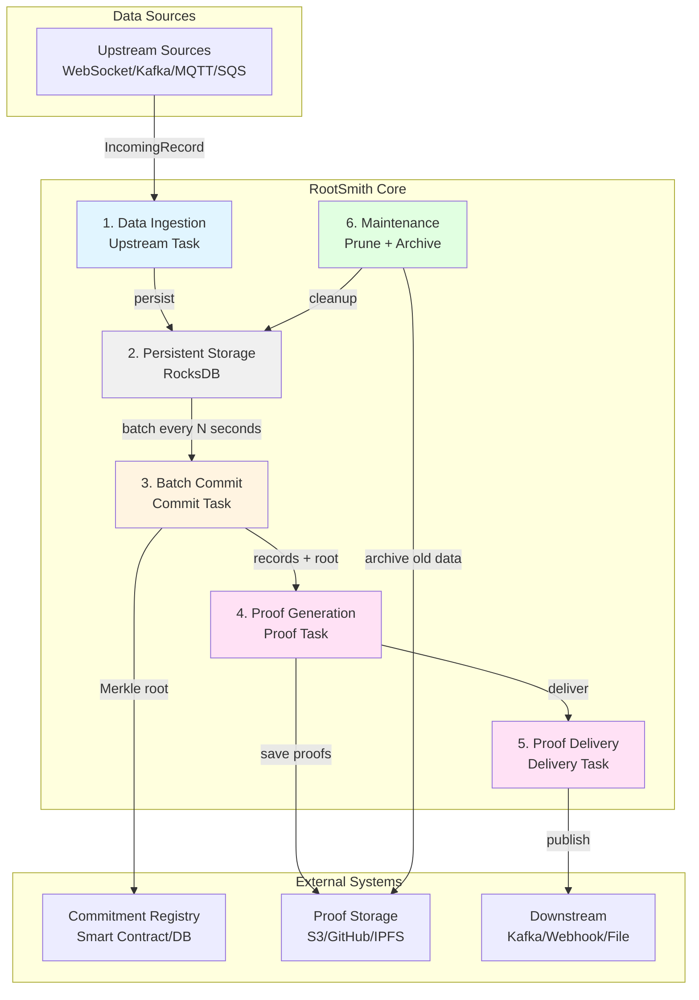
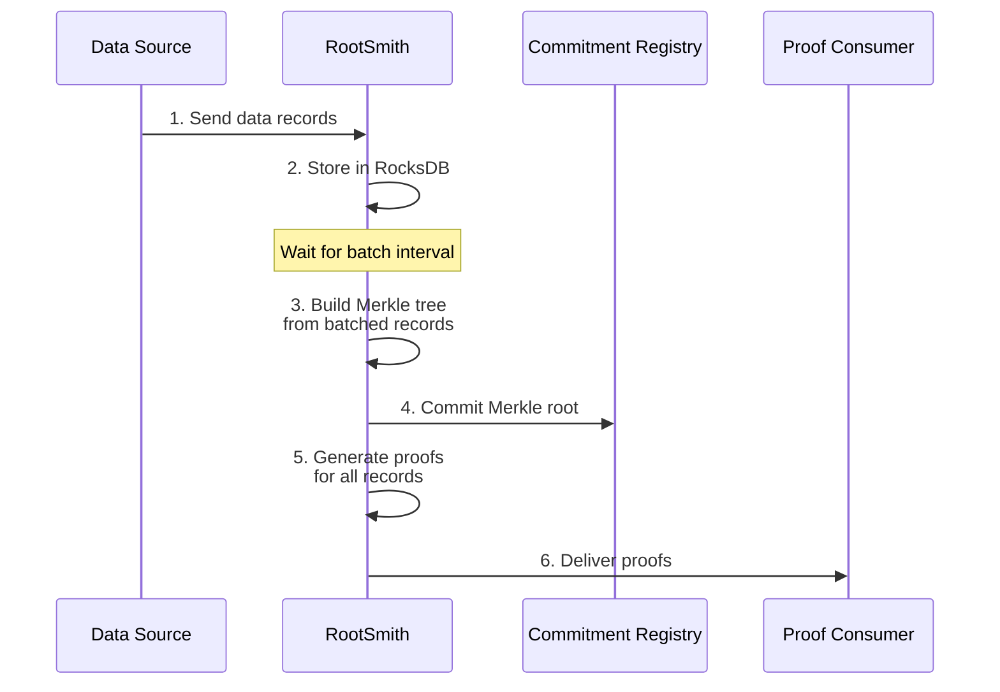
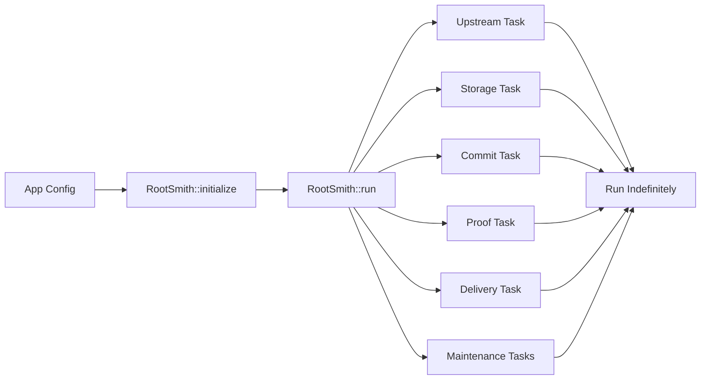

# RootSmith System Landscape

## Overview

RootSmith is a Merkle accumulator service that:

1. Ingests data from upstream sources
2. Batches and commits them periodically
3. Generates cryptographic proofs
4. Delivers proofs to downstream consumers

## System Architecture



## Core Data Flow



## Key Components

### 1. Data Ingestion (Upstream Task)

- **Purpose**: Receive data from external sources
- **Input**: Raw data from WebSocket, Kafka, MQTT, SQS, etc.
- **Output**: `IncomingRecord` → Storage

### 2. Persistent Storage (RocksDB)

- **Purpose**: Store all incoming records with timestamp
- **Key Format**: `namespace || timestamp || key`
- **Query**: Retrieve records by namespace and time range

### 3. Batch Commit (Commit Task)

- **Purpose**: Periodically commit batches to blockchain/registry
- **Process**:
  - Wait for `batch_interval_secs` (e.g., 60 seconds)
  - Scan RocksDB for new records
  - Build Merkle tree and calculate root
  - Commit root to external registry
- **Output**: Merkle root + records → Proof Task

### 4. Proof Generation (Proof Task)

- **Purpose**: Generate cryptographic inclusion proofs
- **Process**:
  - Rebuild Merkle tree from committed records
  - Generate proof for each record
  - Save proofs to storage (S3, GitHub, etc.)
- **Output**: Proofs → Delivery Task

### 5. Proof Delivery (Delivery Task)

- **Purpose**: Deliver proofs to downstream consumers
- **Methods**: Kafka topic, HTTP webhook, file system
- **Format**: JSON with proof, root, and metadata

### 6. Maintenance Tasks

- **DB Prune**: Delete old records after commit (every 5 seconds)
- **Archive**: Move old data to cold storage (every hour, 30+ days old)

## Data Types

### IncomingRecord

```rust
{
    namespace: [u8; 32],  // Logical partition
    key: [u8; 32],        // Unique key
    value: [u8; 32],      // Data value
    timestamp: u64        // Unix timestamp
}
```

### Commitment

```rust
{
    namespace: [u8; 32],  // Namespace ID
    root: Vec<u8>,        // Merkle root hash
    committed_at: u64     // Commit time
}
```

### Proof

```rust
{
    root: Vec<u8>,        // Merkle root
    proof: Vec<u8>,       // Proof bytes (Merkle path)
    key: [u8; 32],        // Key being proved
    meta: JSON            // Namespace, timestamp, etc.
}
```

## Pluggable Components

All external integrations are behind traits, allowing easy customization:

| Component      | Trait                | Implementations                   |
| -------------- | -------------------- | --------------------------------- |
| Data Sources   | `UpstreamConnector`  | WebSocket, Kafka, MQTT, SQS, Mock |
| Commitment     | `CommitmentRegistry` | Smart Contract, DB, Mock          |
| Proof Storage  | `ProofRegistry`      | S3, GitHub, IPFS, Mock            |
| Proof Delivery | `ProofDelivery`      | Kafka, Webhook, File, Mock        |
| Archive        | `ArchiveStorage`     | S3 Glacier, File, Mock            |
| Merkle Tree    | `Accumulator`        | Sparse Merkle, Standard Merkle    |

## Configuration

```rust
{
    storage_path: String,              // RocksDB directory
    batch_interval_secs: u64,          // How often to commit (e.g., 60)
    accumulator_type: Sparse|Merkle    // Which Merkle tree to use
}
```

## Example Workflow

**Scenario**: Timestamping service for documents

1. **Ingest**: User uploads document hash via WebSocket

   ```json
   {
     "namespace": "docs",
     "key": "doc123",
     "value": "hash...",
     "timestamp": 1704067200
   }
   ```

2. **Store**: RootSmith persists to RocksDB immediately

3. **Commit** (after 60 seconds):

   - Collect all documents from last minute
   - Build Merkle tree: `root = H(H(doc123) || H(doc456) || ...)`
   - Submit root to Ethereum smart contract
   - Transaction hash: `0x1234...`

4. **Prove**:

   - Generate Merkle proof for `doc123`
   - Proof shows `doc123` is included in committed root
   - Save proof to S3: `s3://proofs/doc123.json`

5. **Deliver**:
   - Publish proof to Kafka topic `document-proofs`
   - Consumer verifies proof against blockchain root
   - User can prove document existence at specific time

## Key Benefits

### Modularity

- Swap components without changing core logic
- Easy to add new upstream sources or delivery methods

### Reliability

- All data persisted before commitment
- Proofs generated after successful commitment
- Independent task failures don't affect others

### Efficiency

- Batch processing reduces blockchain transactions
- Async tasks maximize throughput
- RocksDB provides fast local storage

### Testability

- Mock implementations for all external systems
- Extracted methods for unit testing
- E2E tests with full pipeline

## Deployment



All tasks run concurrently and communicate via async channels.

## Future Enhancements

- **Query API**: REST/gRPC interface to query storage
- **Metrics**: Prometheus metrics for monitoring
- **Admin API**: Health checks and configuration
- **Multi-tenancy**: Namespace isolation and quotas
